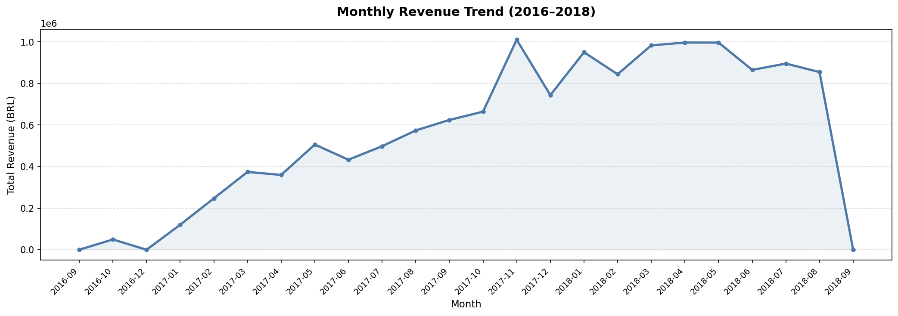
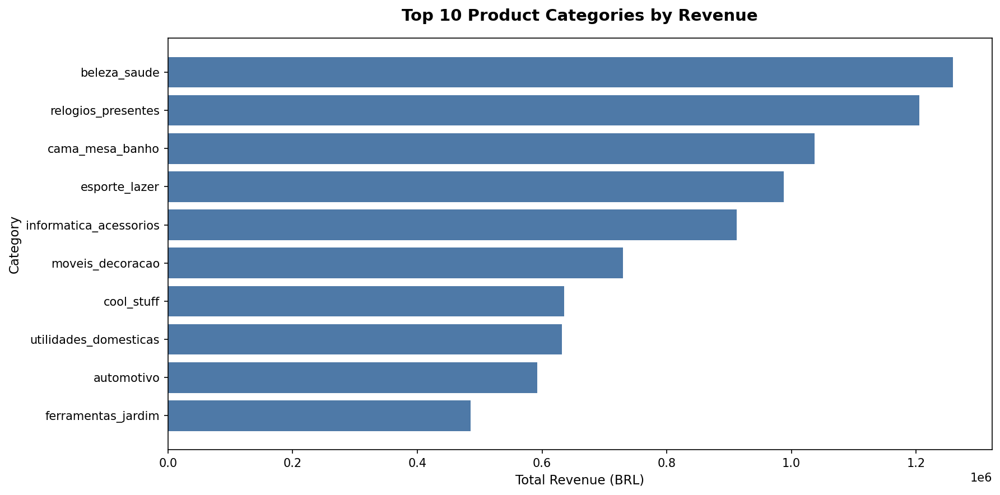
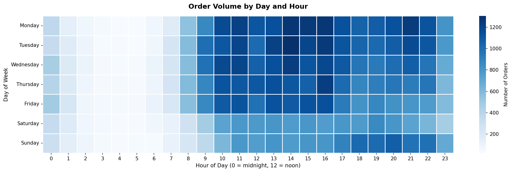
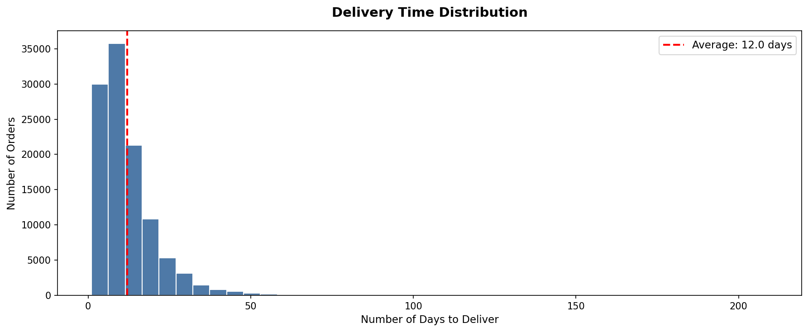
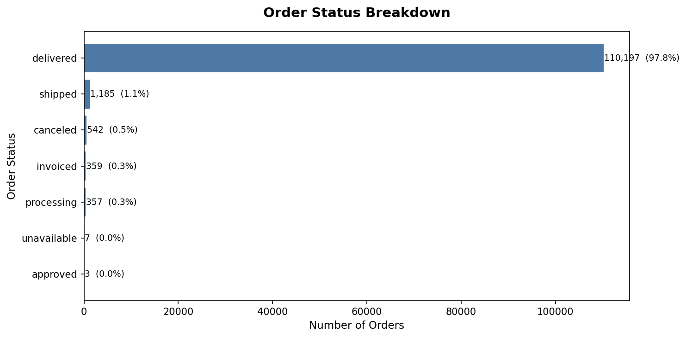
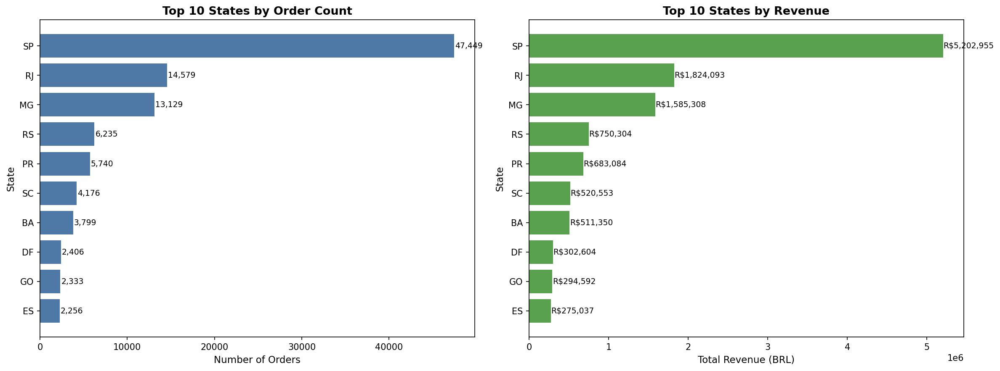

#  E-Commerce Sales Analysis — Olist Brazil

## Project Overview
Analysed 100,000+ real e-commerce orders from Olist (Brazil's largest 
e-commerce platform) to uncover revenue trends, top performing categories, 
customer behaviour and delivery performance.

## Tools Used
- Python (Pandas, Matplotlib, Seaborn) — data cleaning & EDA
- Google Colab — development environment
- Power BI — interactive dashboard

## Dataset
- Source: [Olist E-Commerce Dataset — Kaggle](https://www.kaggle.com/datasets/olistbr/brazilian-ecommerce)
- Size: 112,650 orders after cleaning
- Period: September 2016 to August 2018

## Key Business Insights

1. **Seasonality** — November 2017 was peak revenue month at R$1,010,271
   driven by Black Friday. Q4 stock planning should prioritise this period.

2. **Top Categories** — Beauty & Health, Watches & Gifts, and Bed & Bath
   are the top 3 revenue generating categories.

3. **Peak Ordering Time** — Tuesday at 2PM sees highest order volume (1,304 orders).
   Ideal window for promotional campaigns and push notifications.

4. **Delivery Performance** — Average delivery time is 12 days.
   50% of orders arrive within 10 days but worst case was 209 days,
   suggesting logistics inconsistency in certain regions.

5. **Geographic Concentration** — São Paulo accounts for 42% of all orders
   and R$5.2M in revenue. Expanding fulfilment in RJ and MG could
   reduce delivery times in those states.

6. **Platform Reliability** — 97.8% of orders were successfully delivered,
   showing strong operational performance.

## Dashboard Preview

## Project Structure
├── olist_ecommerce_analysis.ipynb  — full cleaning & EDA notebook
├── master_clean.csv                — cleaned dataset
├── olist_ecommerce_dashboard.pbix  — Power BI dashboard file
└── *.png                           — chart exports
## How to Run
1. Download dataset from Kaggle link above
2. Open `olist_ecommerce_analysis.ipynb` in Google Colab
3. Run all cells in order
4. Open `olist_ecommerce_dashboard.pbix` in Power BI Desktop
